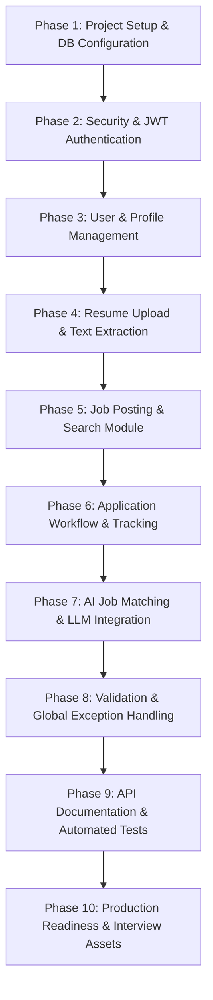

# AI-Powered Job Portal — Implementation Plan (`plan.md`)

> **Project Goal**: Build a production-grade, modular monolith AI-Powered Job Portal in Java and Spring Boot that demonstrates clean architecture, OOP/SOLID principles, robust security (JWT + RBAC), resume text parsing, MySQL relational modeling, and intelligent LLM-driven candidate-job matching.

---

## 1. Project Tech Stack & Tools

| Component | Technology / Library | Description |
|---|---|---|
| **Language** | Java 17 / 21 | Modern LTS Java |
| **Framework** | Spring Boot 3.x | Core framework (Spring MVC, Spring Data JPA) |
| **Database** | MySQL 8.x | Relational database (Hibernate / JPA ORM) |
| **Security** | Spring Security 6.x + jjwt | Stateless JWT authentication, password hashing (BCrypt), RBAC |
| **Document Parsing** | Apache Tika / PDFBox / POI | Text extraction from PDF & DOCX resumes |
| **AI / LLM Client** | Spring `RestClient` / `WebClient` | External LLM integration (Google Gemini / OpenAI REST API) |
| **Validation** | Hibernate Validator (`spring-boot-starter-validation`) | Declarative Bean Validation (`@Valid`, `@NotBlank`, etc.) |
| **Documentation** | Springdoc OpenAPI (Swagger UI) | Interactive API exploration and contracts |
| **Testing** | JUnit 5, Mockito, Spring Boot Test | Unit testing and MockMvc integration tests |
| **Build Tool** | Maven / Gradle | Dependency management and build automation |

---

## 2. Architecture & Modular Package Structure

### 2.1 Layered Modular Monolith Architecture
```
                     CLIENT (Web / Mobile / Postman)
                                   |
                                   ↓ [HTTP / HTTPS]
                     +----------------------------+
                     |    SPRING BOOT MONOLITH    |
                     +----------------------------+
                                   |
    +-------------+------------+---+------------+-------------+
    ↓             ↓            ↓                ↓             ↓
[Auth Mod]   [User Mod]   [Job Mod]    [Application Mod]  [AI Mod]
    |             |            |                |             |
    |             ↓            |                |             ↓
    |        [Resume Mod]      |                |       [LLM Client]
    |             ↓            |                |             ↓
    |     [Text Extractor]     |                |     [External LLM]
    |             |            |                |
    +-------------+------------+----------------+
                                   |
                                   ↓
                         [SERVICE LAYER]
                          (@Transactional)
                                   |
                                   ↓
                       [REPOSITORY LAYER (JPA)]
                                   |
                                   ↓
                            MySQL Database
```

### 2.2 Package Structure (`com.jobportal`)
```
com.jobportal
├── JobPortalApplication.java
│
├── auth
│   ├── controller
│   │   └── AuthController.java
│   ├── dto
│   │   ├── AuthResponse.java
│   │   ├── LoginRequest.java
│   │   └── RegisterRequest.java
│   └── service
│       └── AuthService.java
│
├── user
│   ├── controller
│   │   ├── ProfileController.java
│   │   └── UserController.java
│   ├── dto
│   │   ├── ProfileRequest.java
│   │   ├── ProfileResponse.java
│   │   ├── UserResponse.java
│   │   └── UserUpdateRequest.java
│   ├── entity
│   │   ├── Profile.java
│   │   └── User.java
│   ├── repository
│   │   ├── ProfileRepository.java
│   │   └── UserRepository.java
│   └── service
│       ├── ProfileService.java
│       └── UserService.java
│
├── resume
│   ├── controller
│   │   └── ResumeController.java
│   ├── dto
│   │   └── ResumeResponse.java
│   ├── entity
│   │   └── Resume.java
│   ├── parser
│   │   ├── DocumentParser.java
│   │   ├── DocumentParserFactory.java
│   │   ├── DocxDocumentParser.java
│   │   └── PdfDocumentParser.java
│   ├── repository
│   │   └── ResumeRepository.java
│   └── service
│       ├── FileStorageService.java
│       └── ResumeService.java
│
├── job
│   ├── controller
│   │   └── JobController.java
│   ├── dto
│   │   ├── JobCreateRequest.java
│   │   ├── JobResponse.java
│   │   ├── JobSearchCriteria.java
│   │   └── JobUpdateRequest.java
│   ├── entity
│   │   └── Job.java
│   ├── repository
│   │   ├── JobRepository.java
│   │   └── JobSpecification.java
│   └── service
│       └── JobService.java
│
├── application
│   ├── controller
│   │   └── ApplicationController.java
│   ├── dto
│   │   ├── ApplicationResponse.java
│   │   ├── ApplyJobRequest.java
│   │   └── UpdateApplicationStatusRequest.java
│   ├── entity
│   │   └── JobApplication.java
│   ├── repository
│   │   └── ApplicationRepository.java
│   └── service
│       └── ApplicationService.java
│
├── ai
│   ├── client
│   │   ├── GeminiLLMClient.java
│   │   └── LLMClient.java
│   ├── controller
│   │   └── AIController.java
│   ├── dto
│   │   ├── AIJobMatchRequest.java
│   │   └── AIJobMatchResponse.java
│   └── service
│       ├── AIService.java
│       └── PromptBuilder.java
│
├── security
│   ├── CustomUserDetails.java
│   ├── CustomUserDetailsService.java
│   ├── JwtAuthenticationEntryPoint.java
│   ├── JwtAuthenticationFilter.java
│   ├── JwtService.java
│   └── SecurityConfig.java
│
├── exception
│   ├── AIServiceException.java
│   ├── DuplicateResourceException.java
│   ├── ErrorResponse.java
│   ├── FileStorageException.java
│   ├── GlobalExceptionHandler.java
│   ├── InvalidOperationException.java
│   ├── ResourceNotFoundException.java
│   └── UnauthorizedAccessException.java
│
├── enums
│   ├── ApplicationStatus.java
│   ├── EmploymentType.java
│   ├── JobStatus.java
│   └── Role.java
│
└── config
    ├── ApplicationConfig.java
    └── OpenApiConfig.java
```

---

## 3. Database Schema Design & Relationships

```
 +--------------------+       1:1       +--------------------+
 |       users        | <-------------> |      profiles      |
 +--------------------+                 +--------------------+
 | id (PK, BIGINT)    |                 | id (PK, BIGINT)    |
 | name (VARCHAR)     |                 | user_id (FK, UQ)   |
 | email (UQ, VARCHAR)|                 | headline (VARCHAR) |
 | password (VARCHAR) |                 | bio (TEXT)         |
 | phone (VARCHAR)    |                 | location (VARCHAR) |
 | role (ENUM)        |                 | skills (TEXT)      |
 | created_at (TS)    |                 | experience_years   |
 | updated_at (TS)    |                 | education (TEXT)   |
 +--------------------+                 | linkedin_url (VC)  |
         |                              | github_url (VC)    |
         | 1:N                          | portfolio_url (VC) |
         |                              +--------------------+
         +---------------------------------------+
         |                                       |
         ↓ 1:N (Recruiter)                       ↓ 1:N (Candidate)
 +--------------------+                 +--------------------+
 |        jobs        |                 |      resumes       |
 +--------------------+                 +--------------------+
 | id (PK, BIGINT)    |                 | id (PK, BIGINT)    |
 | recruiter_id (FK)  |                 | user_id (FK)       |
 | title (VARCHAR)    |                 | file_name (VARCHAR)|
 | description (TEXT) |                 | file_type (VARCHAR)|
 | company_name (VC)  |                 | storage_path (VC)  |
 | location (VARCHAR) |                 | extracted_text(MED)|
 | employment_type    |                 | created_at (TS)    |
 | experience_required|                 | updated_at (TS)    |
 | salary_min (DEC)   |                 +--------------------+
 | salary_max (DEC)   |                          |
 | skills_required(VC)|                          | 1:N
 | status (ENUM)      |                          |
 | created_at (TS)    |                          |
 | updated_at (TS)    |                          |
 +--------------------+                          |
         |                                       |
         | 1:N                                   |
         ↓                                       ↓
 +---------------------------------------------------+
 |                   applications                    |
 +---------------------------------------------------+
 | id (PK, BIGINT)                                   |
 | job_id (FK, BIGINT)                               |
 | candidate_id (FK, BIGINT)                         |
 | resume_id (FK, BIGINT)                            |
 | status (ENUM)                                     |
 | applied_at (TIMESTAMP)                            |
 | updated_at (TIMESTAMP)                            |
 | UNIQUE KEY (candidate_id, job_id)                 |
 +---------------------------------------------------+
```

---

## 4. Phased Implementation Roadmap



---

### Phase 1: Project Setup & Database Configuration
- [ ] Initialize Spring Boot 3.x project with Maven (`pom.xml`).
- [ ] Configure dependencies:
  - `spring-boot-starter-web`
  - `spring-boot-starter-data-jpa`
  - `spring-boot-starter-security`
  - `spring-boot-starter-validation`
  - `mysql-connector-j`
  - `jjwt-api`, `jjwt-impl`, `jjwt-jackson` (0.12.x)
  - `apache-tika-core` / `pdfbox` / `poi-ooxml`
  - `springdoc-openapi-starter-webmvc-ui`
  - `lombok` (optional/standard)
  - `spring-boot-starter-test`
- [ ] Configure `application.yml` / `application.properties`:
  - MySQL Datasource (`jdbc:mysql://localhost:3306/job_portal_db`)
  - JPA / Hibernate properties (`ddl-auto: update`, SQL formatting)
  - File upload limits (e.g. 10MB max file size)
  - JWT secret and expiration settings
  - LLM API key and endpoint configuration
- [ ] Create base entity class (`BaseEntity`) for auditing (`createdAt`, `updatedAt`).

---

### Phase 2: Authentication & Authorization (Spring Security + JWT)
- [ ] Create `Role` enum (`ROLE_CANDIDATE`, `ROLE_RECRUITER`, `ROLE_ADMIN`).
- [ ] Implement `User` entity & `UserRepository`.
- [ ] Implement `PasswordEncoder` bean (`BCryptPasswordEncoder`).
- [ ] Implement `CustomUserDetails` and `CustomUserDetailsService`.
- [ ] Implement `JwtService`:
  - Token generation with claims (userId, role).
  - Token validation & expiry verification.
  - Extract username / userId / role from token.
- [ ] Implement `JwtAuthenticationFilter` extending `OncePerRequestFilter`.
- [ ] Configure `SecurityConfig` with `SecurityFilterChain`:
  - Disable CSRF for stateless REST.
  - Configure stateless session management (`SessionCreationPolicy.STATELESS`).
  - Configure unauthorized entry point (`JwtAuthenticationEntryPoint`).
  - Permit public endpoints (`/api/auth/**`, `/api/jobs/**` for GET, `/swagger-ui/**`, `/v3/api-docs/**`).
  - Secure recruiter-only and candidate-only endpoints using `.hasRole()`.
- [ ] Build `AuthService` and `AuthController`:
  - `POST /api/auth/register` (Validate email uniqueness, hash password, return token/user DTO).
  - `POST /api/auth/login` (Authenticate credentials, issue JWT).
  - `POST /api/auth/logout` (Client-side token discard / optional blacklist hook).

---

### Phase 3: User & Profile Management
- [ ] Create `Profile` entity:
  - Fields: `headline`, `bio`, `location`, `skills`, `experienceYears`, `education`, `linkedinUrl`, `githubUrl`, `portfolioUrl`.
  - Relationship: `@OneToOne` with `User` (`@JoinColumn(name = "user_id", unique = true)`).
- [ ] Implement `ProfileRepository` and `ProfileService`.
- [ ] Build `UserController` & `ProfileController`:
  - `GET /api/users/me` — retrieve authenticated user summary (extract user from SecurityContext).
  - `PUT /api/users/me` — update personal details (name, phone).
  - `GET /api/users/me/profile` — fetch candidate profile.
  - `PUT /api/users/me/profile` — create or update candidate profile details.

---

### Phase 4: Resume Management & Text Parsing
- [ ] Implement `FileStorageService`:
  - Validate file MIME type (`application/pdf`, `application/vnd.openxmlformats-officedocument.wordprocessingml.document`).
  - Validate file size (max 5MB - 10MB) and non-empty status.
  - Generate sanitized, collision-free storage names (UUID + extension).
  - Save file to local storage directory (`uploads/resumes/`).
- [ ] Implement `DocumentParser` strategy pattern:
  - `DocumentParser` interface: `String parse(InputStream inputStream)`.
  - `PdfDocumentParser` using Apache PDFBox / Tika.
  - `DocxDocumentParser` using Apache POI / Tika.
  - `DocumentParserFactory` to resolve parser based on content type.
- [ ] Create `Resume` entity & `ResumeRepository`:
  - Columns: `id`, `user_id`, `fileName`, `fileType`, `storagePath`, `extractedText` (mediumtext / text), `createdAt`.
- [ ] Build `ResumeService` & `ResumeController`:
  - `POST /api/resumes` — upload multipart file, store file, extract text, persist record.
  - `GET /api/resumes` — list authenticated candidate's resumes.
  - `GET /api/resumes/{id}` — fetch resume metadata and extracted text (with ownership check).
  - `DELETE /api/resumes/{id}` — remove DB record and underlying physical file.

---

### Phase 5: Job Posting & Search Module
- [ ] Create `EmploymentType` enum (`FULL_TIME`, `PART_TIME`, `CONTRACT`, `INTERNSHIP`).
- [ ] Create `JobStatus` enum (`DRAFT`, `OPEN`, `CLOSED`).
- [ ] Implement `Job` entity & `JobRepository`:
  - Columns: `recruiter_id`, `title`, `description`, `companyName`, `location`, `employmentType`, `experienceRequired`, `salaryMin`, `salaryMax`, `skillsRequired`, `status`.
- [ ] Implement `JobSpecification` for dynamic multi-criteria search:
  - Keyword search (title, description, company).
  - Location filtering.
  - Required skills matching.
  - Employment type & experience filters.
  - Status filter (default to `OPEN` for candidates).
- [ ] Build `JobService` & `JobController`:
  - Recruiter endpoints (Role: `RECRUITER`):
    - `POST /api/jobs` — create new job listing.
    - `PUT /api/jobs/{id}` — update job listing (enforce recruiter ownership).
    - `DELETE /api/jobs/{id}` — close or delete job (enforce recruiter ownership).
  - Candidate/Public endpoints:
    - `GET /api/jobs` — search & list jobs with pagination (`page`, `size`, `sort`) and filters.
    - `GET /api/jobs/{id}` — get single job details.

---

### Phase 6: Application Workflow & Tracking
- [ ] Create `ApplicationStatus` enum:
  - `APPLIED`, `UNDER_REVIEW`, `SHORTLISTED`, `REJECTED`, `HIRED`, `WITHDRAWN`.
- [ ] Implement `JobApplication` entity & `ApplicationRepository`:
  - Relationship to `Job`, `User` (Candidate), `Resume`.
  - Unique constraint on `(candidate_id, job_id)` to prevent duplicate applications.
- [ ] Implement `ApplicationService` with atomic business rules (`@Transactional`):
  - Rule 1: Candidate cannot apply if job is not `OPEN`.
  - Rule 2: Candidate cannot apply twice to the same job.
  - Rule 3: Candidate must own the selected resume.
  - Rule 4: Recruiter can only view and update applications for their own jobs.
  - Rule 5: Candidates can withdraw their application (`WITHDRAWN`).
- [ ] Build `ApplicationController`:
  - Candidate endpoints (Role: `CANDIDATE`):
    - `POST /api/jobs/{jobId}/applications` — apply for a job.
    - `GET /api/applications/me` — list all applications submitted by candidate.
    - `GET /api/applications/{id}` — get specific application details.
    - `PATCH /api/applications/{id}/withdraw` — withdraw application.
  - Recruiter endpoints (Role: `RECRUITER`):
    - `GET /api/recruiter/applications` — list all applications across recruiter's jobs.
    - `GET /api/jobs/{jobId}/applications` — list applications for a specific job.
    - `PATCH /api/applications/{id}/status` — update candidate application status.

---

### Phase 7: AI Job Matching & LLM Integration
- [ ] Design LLM Client abstraction:
  - `LLMClient` interface: `String generate(String systemPrompt, String userPrompt)`.
  - `GeminiLLMClient` (or `OpenAILLMClient`) using Spring `RestClient` with timeout configurations.
- [ ] Create `PromptBuilder`:
  - System instructions: Expert Technical Recruiter & ATS parser.
  - Strict JSON output format enforcement.
  - Prompt injection sanitization and token bounding.
- [ ] Implement `AIService`:
  - Step 1: Verify authenticated candidate owns the given `resumeId`.
  - Step 2: Fetch resume entity and retrieve extracted text.
  - Step 3: Fetch job entity and retrieve job description & required skills.
  - Step 4: Build prompt and execute LLM call via `LLMClient`.
  - Step 5: Parse and validate JSON response into `AIJobMatchResponse`.
  - Step 6: Return structured DTO.
- [ ] Implement `AIController`:
  - `POST /api/ai/job-match` — candidate matches their resume against a target job.
- [ ] Resilience & Error Handling:
  - Handle external LLM timeouts, 429 rate limits, and unparseable responses with clean `AIServiceException` (HTTP 503 / 502).

---

### Phase 8: Validation, Global Exception Handling & Logging
- [ ] Add Bean Validation annotations on all Request DTOs:
  - `@NotBlank`, `@Email`, `@Size(min = 8)`, `@Min`, `@Max`, `@NotNull`.
- [ ] Implement custom application exceptions extending `RuntimeException`:
  - `ResourceNotFoundException` (404)
  - `DuplicateResourceException` (409)
  - `UnauthorizedAccessException` (403)
  - `InvalidOperationException` (400)
  - `FileStorageException` (400 / 500)
  - `AIServiceException` (503)
- [ ] Implement `GlobalExceptionHandler` with `@RestControllerAdvice`:
  - Handle `MethodArgumentNotValidException` (return field-level validation errors).
  - Handle `BadCredentialsException` & `AccessDeniedException`.
  - Handle custom exceptions with standard `ErrorResponse` schema.
  - Handle generic uncaught exceptions (500).
- [ ] Configure Structured Logging:
  - Log audit events: login attempts, job creation, application submission, AI matching calls.
  - Avoid logging passwords, raw tokens, or sensitive resume contents.

---

### Phase 9: Documentation & Automated Testing
- [ ] Configure Springdoc OpenAPI (`OpenApiConfig`):
  - Set up JWT Bearer authentication scheme in Swagger UI.
  - Add API descriptions, tag groupings, request/response examples.
  - Verify Swagger UI at `/swagger-ui/index.html`.
- [ ] Unit Testing (JUnit 5 + Mockito):
  - `AuthServiceTest` (registration, login with valid/invalid credentials).
  - `JobServiceTest` (create, update, recruiter ownership checks).
  - `ApplicationServiceTest` (apply, duplicate application prevention, status updates).
  - `ResumeServiceTest` & `DocumentParserTest` (mocking file parsing).
  - `AIServiceTest` (mock `LLMClient` returning mocked JSON, test JSON parsing).
- [ ] Integration Testing (`@SpringBootTest` + `MockMvc`):
  - Auth flow (`/api/auth/register` -> `/api/auth/login`).
  - Job creation & public search (`/api/jobs`).
  - Job application flow with JWT token header.
  - RBAC verification (e.g. Candidate calling recruiter endpoint returns 403 Forbidden).

---

### Phase 10: Production Readiness & Interview Preparation Assets
- [ ] Project cleanup:
  - Review code against SOLID principles.
  - Remove debug logs and hardcoded credentials.
  - Move all secrets (JWT secret, DB password, LLM API Key) to environment variables.
- [ ] Create comprehensive `README.md`:
  - Architecture overview & diagrams.
  - Setup and installation instructions.
  - Environment variable list.
  - cURL / Postman collection instructions.
- [ ] Create System Design & Resume Talking Points document:
  - Modular Monolith design rationale vs Microservices.
  - Why text extraction happens before LLM processing.
  - Concurrency & duplicate application prevention strategy.
  - Security model (Stateless JWT + RBAC + Ownership checks).

---

## 5. API Specification Matrix

| HTTP Method | Endpoint | Role / Auth | Description |
|---|---|---|---|
| **POST** | `/api/auth/register` | Public | Register new candidate or recruiter |
| **POST** | `/api/auth/login` | Public | Authenticate user and receive JWT |
| **POST** | `/api/auth/logout` | Authenticated | Logout session |
| **GET** | `/api/users/me` | Authenticated | Get current user details |
| **PUT** | `/api/users/me` | Authenticated | Update user name/phone |
| **GET** | `/api/users/me/profile` | Candidate | Get candidate profile |
| **PUT** | `/api/users/me/profile` | Candidate | Create/update candidate profile |
| **POST** | `/api/resumes` | Candidate | Upload resume (PDF/DOCX) & parse text |
| **GET** | `/api/resumes` | Candidate | List all uploaded resumes |
| **GET** | `/api/resumes/{id}` | Candidate | Get resume details & text |
| **DELETE** | `/api/resumes/{id}` | Candidate | Delete resume file and record |
| **POST** | `/api/jobs` | Recruiter | Create new job post |
| **GET** | `/api/jobs` | Public / Auth | Search & list jobs (paginated, filtered) |
| **GET** | `/api/jobs/{id}` | Public / Auth | Get job details |
| **PUT** | `/api/jobs/{id}` | Recruiter (Owner) | Update job post |
| **DELETE** | `/api/jobs/{id}` | Recruiter (Owner) | Delete / close job |
| **POST** | `/api/jobs/{jobId}/applications` | Candidate | Apply for a job |
| **GET** | `/api/applications/me` | Candidate | Get candidate's applications |
| **GET** | `/api/applications/{id}` | Candidate / Recruiter | Get application details |
| **PATCH** | `/api/applications/{id}/withdraw`| Candidate (Owner) | Withdraw job application |
| **GET** | `/api/recruiter/applications` | Recruiter | List applications across recruiter's jobs |
| **GET** | `/api/jobs/{jobId}/applications` | Recruiter (Owner) | List applications for specific job |
| **PATCH** | `/api/applications/{id}/status` | Recruiter (Owner) | Update application status |
| **POST** | `/api/ai/job-match` | Candidate | AI resume vs job match score & feedback |

---

## 6. AI Matcher Prompt & Response Design

### 6.1 Prompt Contract
- **System Prompt**:
  ```text
  You are an expert Technical Recruiter and ATS analyzer. 
  Compare the provided Candidate Resume Text against the Job Description.
  Evaluate technical skill alignment, experience relevance, and missing qualifications.
  You must output strictly valid JSON matching the specified schema without any markdown wrapping or extra text.
  ```
- **User Prompt**:
  ```text
  Candidate Resume:
  ---
  {resumeText}
  ---

  Job Description:
  ---
  Title: {jobTitle}
  Company: {companyName}
  Required Skills: {skillsRequired}
  Description: {jobDescription}
  ---

  Analyze the match and respond with the following JSON structure:
  {
    "matchScore": <integer between 0 and 100>,
    "matchingSkills": [<list of matched skills>],
    "missingSkills": [<list of missing or weak skills>],
    "experienceMatch": <boolean>,
    "recommendation": "<2-3 sentence assessment>"
  }
  ```

### 6.2 Target DTO Response (`AIJobMatchResponse`)
```json
{
  "matchScore": 85,
  "matchingSkills": [
    "Java",
    "Spring Boot",
    "REST APIs",
    "MySQL",
    "JPA / Hibernate"
  ],
  "missingSkills": [
    "Docker",
    "Kafka"
  ],
  "experienceMatch": true,
  "recommendation": "Strong candidate with direct hands-on experience in Spring Boot backend services. Minor gaps in distributed messaging tools."
}
```

---

## 7. Verification & Acceptance Criteria

- [ ] **Clean Build**: `mvn clean install` runs without errors.
- [ ] **Security**: Unauthenticated requests to protected endpoints return `401 Unauthorized`.
- [ ] **RBAC**: Candidate cannot call `/api/jobs` POST (returns `403 Forbidden`).
- [ ] **Ownership**: Recruiter cannot edit another recruiter's job post.
- [ ] **Duplicate Prevention**: Candidate cannot apply twice to the same job.
- [ ] **File Parsing**: Uploading PDF and DOCX successfully extracts and persists plain text.
- [ ] **AI Resilience**: Mocked and real LLM client return structured `matchScore` and skills; errors gracefully map to HTTP 503.
- [ ] **Test Coverage**: All core services have comprehensive unit tests with >=80% branch coverage on business logic.
